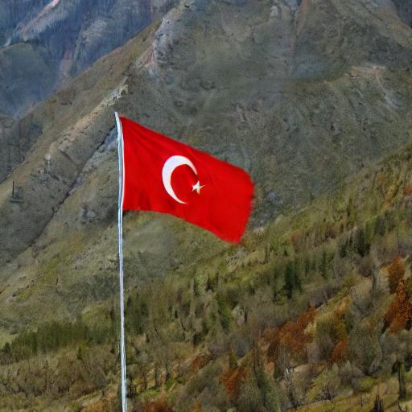
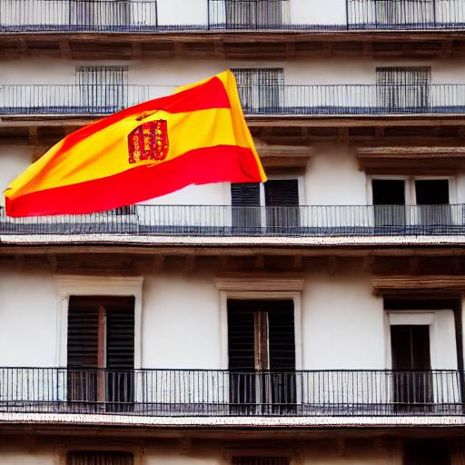

# 🧠 Fine-Tuning Stable Diffusion with LoRA

This project demonstrates fine-tuning Stable Diffusion using **LoRA (Low-Rank Adaptation)** for efficient model adaptation without modifying the original weights. The repository contains the training scripts, optimal hyperparameters found through grid search, and training notes.

---

## 📋 Table of Contents

- [Project Overview](#project-overview)
- [Environment Setup](#environment-setup)
- [Training](#training)
- [Best Hyperparameters](#best-hyperparameters)
- [Results](#results)
- [Notes](#notes)
- [References](#references)
- [License](#license)

---

## 📁 Project Overview

- LoRA fine-tuning script for Stable Diffusion.
- Grid search over key hyperparameters.
- Gradient clipping to prevent NaN loss.
- Training stability improvements.
- Sample output images and observations.

---

## ⚙️ Environment Setup

Start with cloning this repository, then go with Docker or Anaconda setup:

### Docker

Start immediately with the ready-to go docker image

`docker pull ycayca/lora_stabledif:1.0`

Modify the path to the repository and run

`docker run --rm  -it --gpus '"device=0"'  \
    -v /home/yca/LoRa-StableDif:/app/LoRa-StableDif \
    lora_stabledif:1.0 bash`

### Anaconda

`
conda create --name stablediffusion python=3.9
conda activate stablediffusion
pip install torch torchvision diffusers transformers datasets accelerate xformers controlnet_aux bitsandbytes matplotlib torchmetrics torch-fidelity
pip install bing_image_downloader
`

---

## 🏃 Training

Run training:

`python train.py
`

(Optional CLI arguments if supported):

` python train.py --batch_size 16 --lr 5e-5 --timesteps 50 --rank 4 --alpha 8 --dropout 0.5
`

---

## 🔧 Best Hyperparameters

After performing grid search, the following configuration yielded the best results (for the custom flag generation project examined detaily in Medium post):

| Parameter         | Value     |
|------------------|-----------|
| Timesteps        | 50        |
| Learning Rate    | 5e-5      |
| Batch Size       | 16        |
| Rank             | 4         |
| Alpha            | 8         |
| Dropout          | 0.5       |
| Gradient Clipping| max_norm enabled |

---

## 📊 Results

| Prompt Example | Output |
|----------------|--------|
| *"A Turkish flag in the mountains "* |  |
| *"A Spanish flag in front of a building"* |  |

---

## 📝 Notes

- LoRA adapts quickly; usually, 1–3 epochs are sufficient.
- Overtraining can lead to random or noisy outputs.
- Dropout reduces overfitting, especially for small datasets.
- Gradient clipping (max_norm) prevents exploding gradients and NaN losses.

---

## 📚 References

- [LoRA: Low-Rank Adaptation of Large Language Models](https://arxiv.org/abs/2106.09685)
- [Hugging Face Diffusers](https://github.com/huggingface/diffusers)
- [My Medium Article](https://medium.com/@yourusername/your-post-slug)

---

## 📜 License

MIT License — free to use, modify, and share with attribution.
